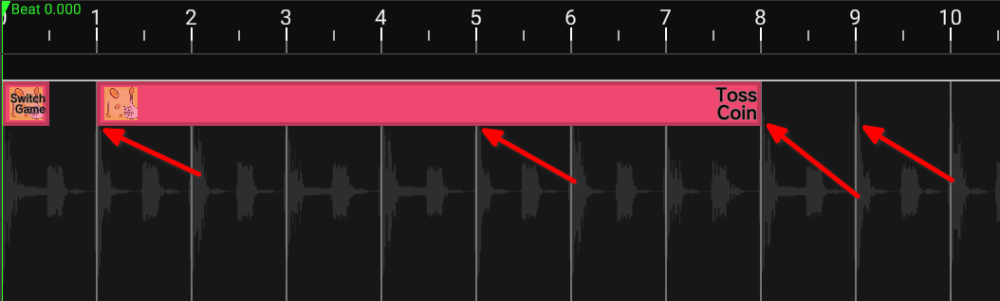

import {HeaderBadgesWidget} from '../../src/components/HeaderWidget.js';

# Finding the song offset

In some audio files, the song doesn't start immediately after the file begins, the song offset indicates the delay between the start of the file and the start of the music, this should help you figure out the offset.

1. Download Audacity
(For Windows/MacOS users, get it from [Audacity's webpage](https://www.audacityteam.org/download/), Linux users check instructions for your distro online.)
2. Open your music file in Audacity
3. Zoom into the start of the music file in the timeline of Audacity
4. Set the cursor right at the start of the music (usually right after the silence at the start of the music file, sometimes a bit after like in Karate Man (GBA))
5. Check the time at the bottom, take the last 3 numbers, that's your offset in milliseconds.

6. Put the offset in Heaven Studio
7. To make sure the offset you got is right, check the waveform, if the beats in the waveform match the timeline's beats, you are good to go.

Note: beats are usually the longest parts of a waveform, check image below for reference

<HeaderBadgesWidget commaDelimitedContributors="Saraistupid" lastDateString="2/10/23" />
