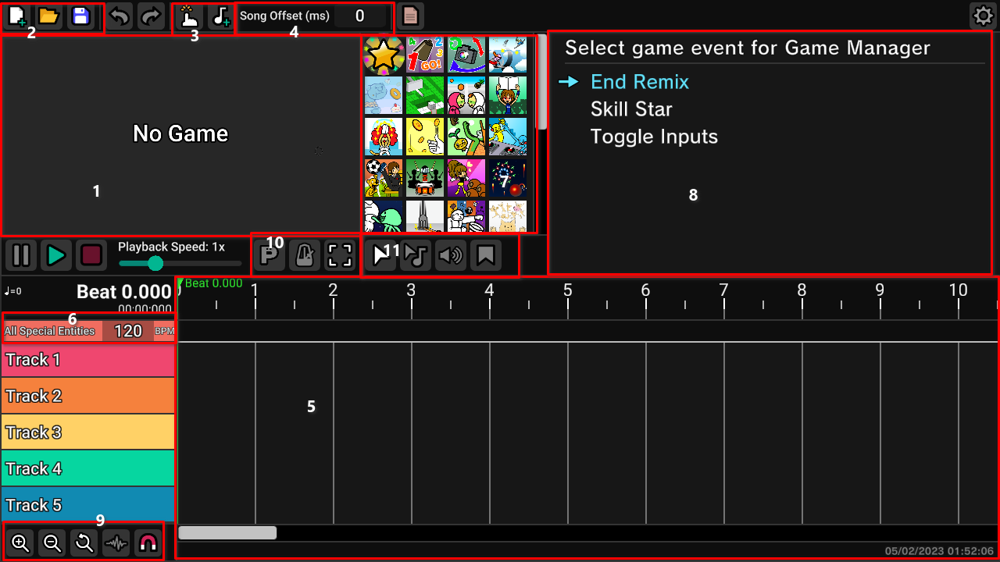

# Getting started with Heaven Studio

After downloading and extracting Heaven Studio, launch the appropriately named "Heaven Studio" executable file.

Heaven Studio's UI is easy to understand, everything is explained below.

**1. The game preview menu, here you will see the preview of your remix being played.**

**2. File actions, which in order are: New Remix, Open Remix, Save Remix**

**3. Music related actions, which in order are: Tempo Finder (Tapping along), Music Select**

**4. Song offset, set how much time (in milliseconds) between the start of the music file and the start of the actual music**

**5. Timeline, where you'll put the events and chart your remix**

**6. The special entities textbox, which by default is set to BPM (changeable from n.11)**

**7. Minigames, here you can select minigames to use in your remix**

**8. Events selection, here you can seelect the minigame events to use in your remix**

**9. Timeline tools, which in order are: Zoom in/Out, Reset Zoom, Toggle Waveform, Change snapping**

**10. Gameplay options, which in order are: Autoplay, Metronome, Preview**

**11. Special entities tools, which in order are: Selection, Tempo change, Music volume, Beatmap section**
