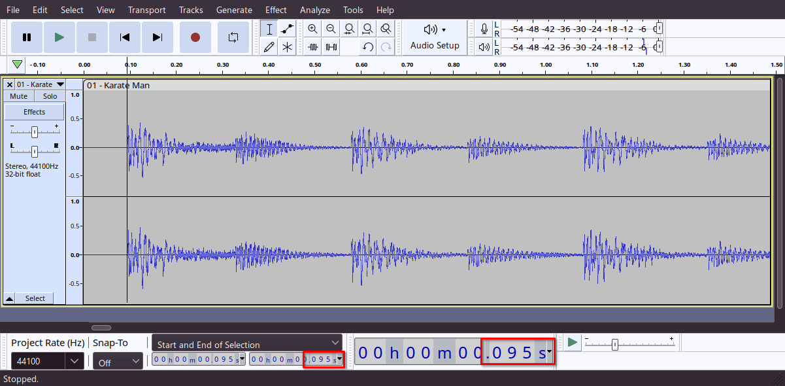

import ReactPlayer from 'react-player'

# Making your first remix with Heaven Studio

Let's get started with your first remix.

## Selecting the music and setting BPM

1. Select the music file from the top left, supported formats are: `.mp3`, `.wav`, and `.ogg`

2. Set the song offset, [you may read how to do that here.](#getting-the-song-offset)

3. Set the BPM, we'll be using Karate Man (GBA) in this tutorial, which is 119BPM.

If all previous steps were done correctly, we should have something like this.

<ReactPlayer controls url='/vid/firstchart/music.mp4' />

### Charting the remix
Let's start charting the remix.

1. Select a minigame from the minigames selection menu

2. From the window right next to it, drag and drop the "Switch Game" event to the timeline

3. Next, press the up/down arrow keys on your keyboard to select other events, since we're using Coin Toss for now, we'll go with "Toss Coin"

4. We'll now switch to another minigame, click the minigame you want to use next from the minigames selection menu then drag and drop the "Switch Game" event to the timeline.
Note: you can right click at the beats bar to select when to start playback

5. Put the event you want to use in the minigame you just switched to, since we're using Karate Man, we'll go with "Toss Object"

This is how it looks and sounds like at the end.

<ReactPlayer controls url='/vid/firstchart/progress.mp4' />

Continue charting your remix as you wish, here's what I came up with at the end.

<ReactPlayer controls url='/vid/firstchart/kmangba.mp4' />

Here's the [download of the remix I made](./assets/firstchart/kmangba.riq) if you need to look at it.

### Getting the Song offset

In some audio files, the song doesn't start immediately after the file begins, the song offset indicates the delay between the start of the file and the start of the music, this should help you figure out the offset.

1. Download Audacity
(For Windows/MacOS users, get it from [Audacity's webpage](https://www.audacityteam.org/download/), Linux users check instructions for your distro online.)
2. Open your music file in Audacity
3. Zoom into the start of the music file in the timeline of Audacity
4. Set the cursor right at the start of the music (usually right after the silence at the start of the music file, sometimes a bit after like in Karate Man (GBA))
5. Check the time at the bottom, take the last 3 numbers, that's your offset in milliseconds.

6. Put the offset in Heaven Studio
7. To make sure the offset you got is right, check the waveform, if the beats in the waveform match the timeline's beats, you are good to go.

Note: beats are usually the longest parts of a waveform, check image below for reference

