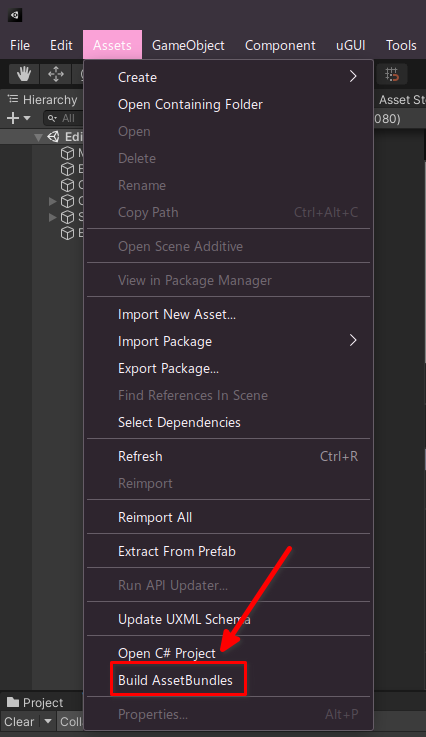

# Loading the project

After finally cloning the repository, you can now open it in Unity.

1. Open UnityHub
2. Click "Open"

3. Browse to your repository and load it
4. Click the project in UnityHub

5. If you see any warning about a wrong unity version, select your current one or just ignore the warning.

And now after loading the project in Unity, build AssetBundles by doing the following:
1. Go to Assets
2. Click "Build AssetBundles"

